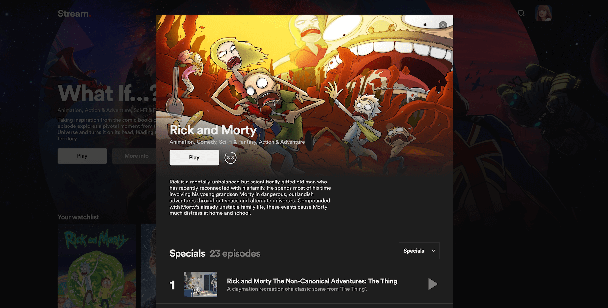
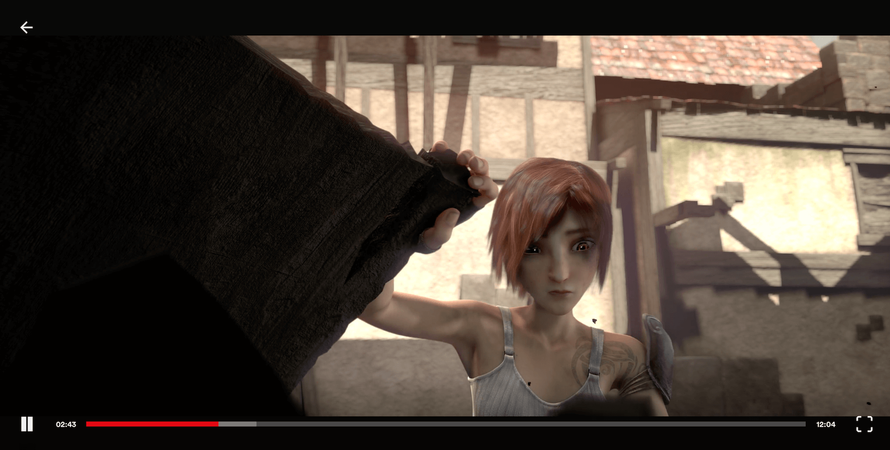

**Last Update: 01.11.2022**

A video streaming demo platform built with Next.js, inspired by Netflix, using a custom video player and providing a streaming example following the HLS protocol.

https://streaming-platform-tmdb.vercel.app/



## Frontend
- React.js
- Next.js
- Typescript
- Styled Components
- Redux
- Hls.js

**Image optimization is disabled due to Fair Use Policy.**

## Known issues
1. Player isn't properly reset - Solution: Move player store to watch route

## API
The following api is being utilized: https://developers.themoviedb.org/3/getting-started/introduction

## Next.js
### Middleware & Edge Functions
Whether or not a profile has been selected is being checked on the edge at the speed of static to handle a possible redirect.

## Custom Media Player
The application uses its own custom media player. Because of missing resources audio and subtitle selection are not included.



## Getting Started

Make sure to copy paste the `.env.public` contents to your local dotenv file and fill in the missing fields.

Then, run the development server:

```bash
npm run dev
# or
yarn dev
```

Open [http://localhost:3000](http://localhost:3000) with your browser to see the result.

The `pages/api` directory is mapped to `/api/*`. Files in this directory are treated as [API routes](https://nextjs.org/docs/api-routes/introduction) instead of React pages.
